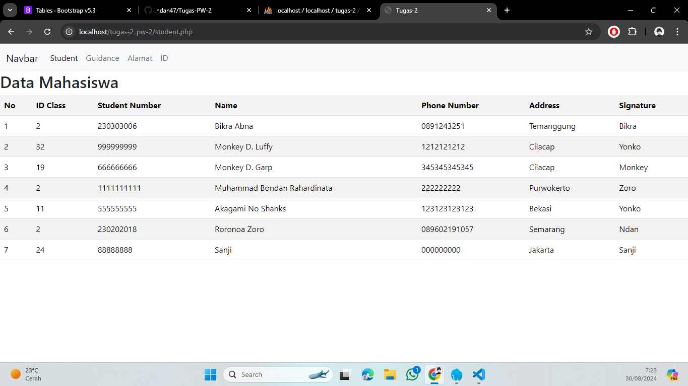
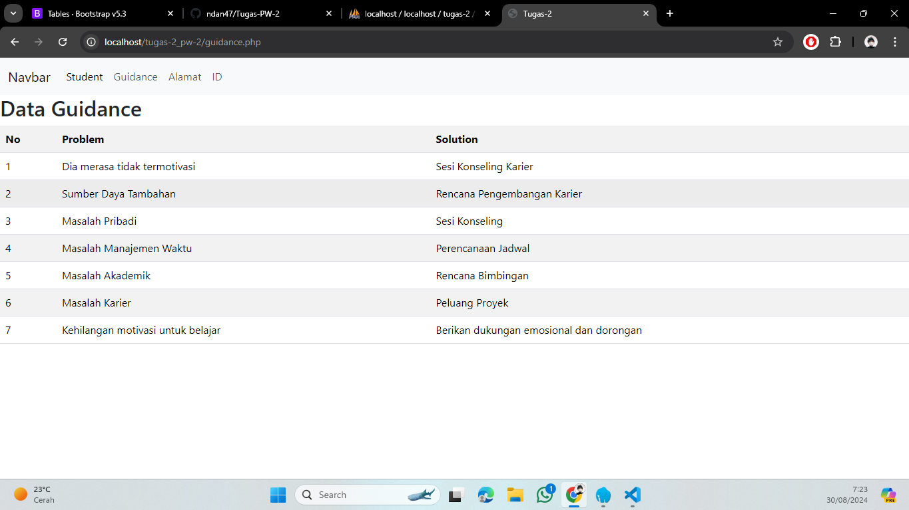
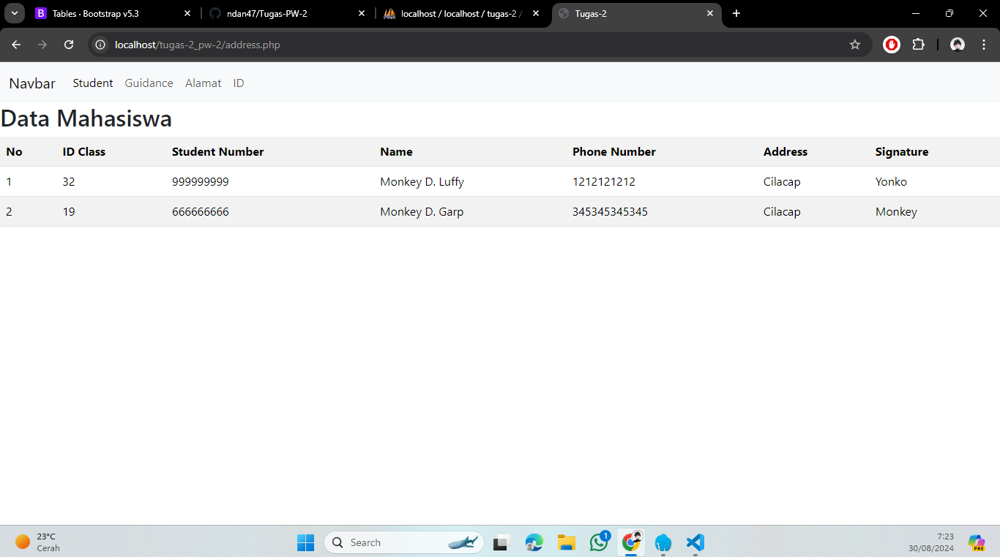
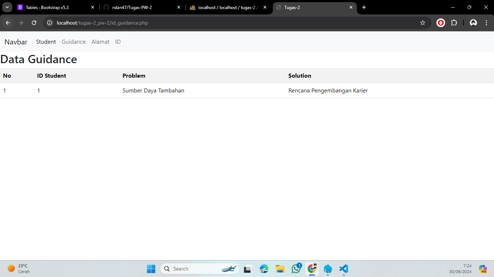

# Tugas-2 Praktikum WEB 2

ERD dari tugas-2 yaitu student dan guidance

## Tugas

1. Membuat view berbasis OOP PHP, dengan mengambil data dari MySQL database "tugas-2" terdapat tabel student dan tabel guidance
2. Menggunakan method __counstruct sebagai link untuk mengkoneksi ke database
```php
<?php
// class Database berfungsi untuk mengelola koneksi ke database
class Database {
     // attribute atau properti privat untuk menyimpan detail koneksi database
    private $host = "localhost";
    private $username = "root";
    private $password = "";
    private $database = "tugas-2";
    protected $conn;

    // construct untuk inisialisasi koneksi database
    public function __construct() {
        // membuat koneksi baru ke database menggunakan mysqli
        $this->conn = new mysqli($this->host, $this->username, $this->password, $this->database);
        // mengecek koneksi sukses atau tidak
        if ($this->conn) {
            
        }
    }
}
?>
```
3. Menerapkan encapsulation sesuai logika studi khusus
```php
<?php
    private $host = "localhost";
    private $username = "root";
    private $password = "";
    private $database = "tugas-2";
    protected $conn;
?>
```
4. Menggunakan kelas turunan dengan teknik inheritancec
```php
<?php
class Student extends Database {
    public function tampilData() {
tabel students
        $data = $this->conn->query("SELECT * FROM students");  
        return $data;  
    }
}

class Guidance extends Database {
    public function tampilData() {
        $data = $this->conn->query("SELECT * FROM guidance");
        return $data->fetch_all(MYSQLI_ASSOC);
    }
}
?>
```
5. Menerapkan teknik Polymorphism
```php
class Student extends Database {
    public function tampilData() {
        $data = $this->conn->query("SELECT * FROM students");  
        return $data;  
    }
}

class Address extends Student { 
    public function tampilData() {
        $data = $this->conn->query("SELECT * FROM students WHERE address = 'Cilacap'");  
        return $data->fetch_all(MYSQLI_ASSOC);  
    }
}
?>
```

## Output program
1. Menampilkan seluruh isi tabel student


2. Menampilkan isi tabel guidance


3. Menampilkan isi tabel student yang terdapat di class Address


4. Menampilkan isi tabel guidance yang terdapat di class ID guidance

